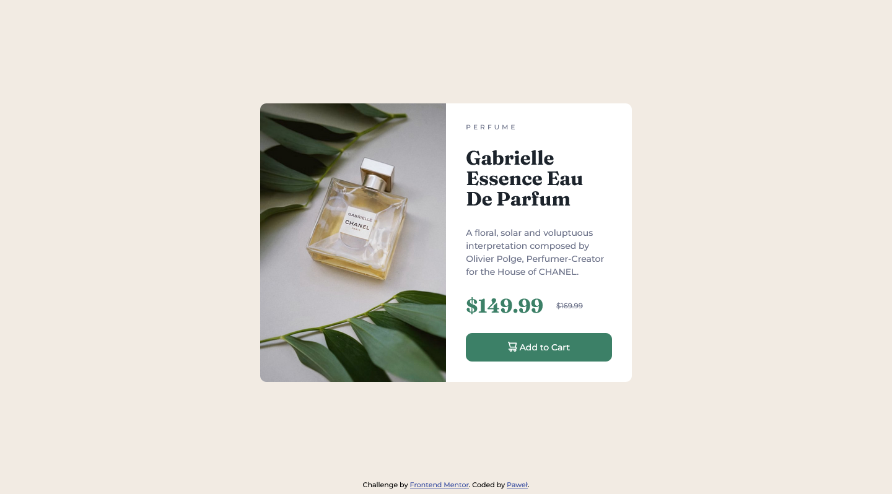

# Frontend Mentor - Product preview card component solution

This is a solution to the [Product preview card component challenge on Frontend Mentor](https://www.frontendmentor.io/challenges/product-preview-card-component-GO7UmttRfa). 

## Table of contents

- [Overview](#overview)
  - [The challenge](#the-challenge)
  - [Screenshot](#screenshot)
  - [Links](#links)
- [My process](#my-process)
  - [Built with](#built-with)
  - [What I learned](#what-i-learned)
  - [Continued development](#continued-development)
  - [Useful resources](#useful-resources)
- [Author](#author)
- [Acknowledgments](#acknowledgments)

## Overview

### The challenge

Users should be able to:

- View the optimal layout depending on their device's screen size
- See hover and focus states for interactive elements

### Screenshot

### Links

- Solution URL: [https://www.frontendmentor.io/solutions/product-preview-box-with-sassscss-and-picture-for-image-LNlLbGBT4F](https://www.frontendmentor.io/solutions/product-preview-box-with-sassscss-and-picture-for-image-LNlLbGBT4F)
- Live Site URL: [https://thespiritcode.github.io/frontentmentor-challange-2/](https://thespiritcode.github.io/frontentmentor-challange-2/)

## My process

### Built with

- Semantic HTML5 markup
- SCSS custom properties
- Flexbox

### What I learned

That was basically first project I did with flexbox from the scratch, so that was new to me. I know now how to center a div! 😁

### Continued development

There is still a lot to learn in flexbox area for me. I hope I can learn more than just boxing and centering items later on.
